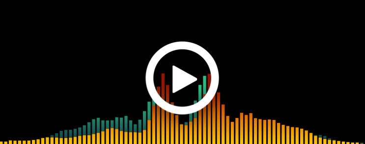

# AudioSpectrum

更多信息请参考：  
[一步一步教你实现iOS音频频谱动画（一）](https://juejin.im/post/5c1bbec66fb9a049cb18b64c)  
一步一步教你实现iOS音频频谱动画（二） 未发布

`AudioSpectrum01`项目是第一篇博客的示例代码，包含音频播放和频谱数据计算

`AudioSpectrum02`项目是第二篇博客的示例代码，基于`01`项目进行了些许重构外，增加了动画实现的代码

>如果你想跟着博客一步一步实现的话，请使用对应的`starter`项目，如果只想浏览最终的实现代码请查看对应的`final`项目就好

说明：代码中的音频文件来自NoCopyrightSounds，不涉及版权

